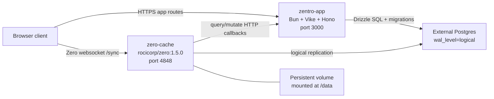

# Docker Deployment

Production deployment guide for Zentro with Docker: either **Docker Compose** (`deploy/docker-compose.prod.yml`) or separate containers on any cloud that supports Dockerfiles, plus an external managed Postgres.

Do not commit secrets, database passwords, or auth secrets. Keep those in your platform's secret manager or runtime environment variables only.

## Topology



| Component | How it runs | Persistent storage |
| --- | --- | --- |
| App/API | Container from `deploy/app/Dockerfile` | None |
| zero-cache | Container from `deploy/zero-cache/Dockerfile` | Platform volume at `/data` |
| Postgres | External managed database | Provider-managed |

Local development uses `docker compose up -d` (Postgres only) or `deploy/docker-compose.local.yml` (full stack with bundled Postgres).

## Docker Compose (production)

Use `deploy/docker-compose.prod.yml` when the host runs Compose directly. It deploys **app + zero-cache** only; Postgres stays external.

```sh
cp deploy/.env.production.example deploy/.env.production
# edit deploy/.env.production — DATABASE_URL, domains, secrets

docker compose -f deploy/docker-compose.prod.yml --env-file deploy/.env.production up -d --build
```

| File | Purpose |
| --- | --- |
| `deploy/docker-compose.prod.yml` | Production Compose stack (app + zero-cache) |
| `deploy/.env.production.example` | Template for required production env vars |
| `deploy/.env.production` | Local secrets file (gitignored) |

Compose behavior:

- **External DB** — `DATABASE_URL` must reach your managed Postgres (`wal_level=logical`).
- **Internal callbacks** — zero-cache calls `http://app:3000/api/zero/*` on the Compose network.
- **Public URLs** — `BETTER_AUTH_URL`, `ZERO_CACHE_URL`, and `BETTER_AUTH_TRUSTED_ORIGINS` must match what browsers use (HTTPS + sibling subdomains).
- **Persistent zero replica** — named volume `zentro_zero_data` mounted at `/data`.
- **Fail-fast migrations** — app entrypoint runs `db:migrate` before start; failed migrations stop the container.
- **Health gates** — zero-cache starts only after the app health check passes.

Update or redeploy:

```sh
docker compose -f deploy/docker-compose.prod.yml --env-file deploy/.env.production up -d --build
```

Stop without deleting the zero replica:

```sh
docker compose -f deploy/docker-compose.prod.yml --env-file deploy/.env.production down
```

## Repository layout

| Path | Purpose |
| --- | --- |
| `deploy/app/Dockerfile` | Production app image (Bun build + runtime) |
| `deploy/zero-cache/Dockerfile` | Thin wrapper around `rocicorp/zero:1.5.0` |
| `deploy/docker-compose.prod.yml` | Production Compose (app + zero-cache, external Postgres) |
| `deploy/docker-compose.local.yml` | Local full-stack smoke test (Postgres + app + zero-cache) |
| `scripts/docker-entrypoint.sh` | Runs migrations, then starts the app |
| `.dockerignore` | Keeps build context small and excludes secrets |

Build images locally from the repository root:

```sh
docker build -f deploy/app/Dockerfile -t zentro-app:latest .
docker build -f deploy/zero-cache/Dockerfile -t zentro-zero:latest .
```

## Prerequisites

### External Postgres

Zero requires Postgres with logical replication enabled. On the managed Postgres provider, set:

```sql
ALTER SYSTEM SET wal_level = 'logical';
```

Restart Postgres, then verify:

```sql
SHOW wal_level;
-- expected: logical
```

Also raise replication limits if the provider allows it (mirrors local dev defaults):

```sql
ALTER SYSTEM SET max_wal_senders = 10;
ALTER SYSTEM SET max_replication_slots = 10;
```

Until `wal_level` is `logical`, `zero-cache` fails at startup with:

```txt
Postgres must be configured with "wal_level = logical"
```

Use a **direct** Postgres connection string for Zero replication when possible. Connection poolers in transaction mode (common on serverless Postgres) can break logical replication. If the provider offers both pooled and direct URLs, give `DATABASE_URL` and Zero upstream URLs the direct variant.

### Persistent volume for zero-cache

`zero-cache` stores its SQLite replica at `ZERO_REPLICA_FILE=/data/replica.db`. That path must be backed by **persistent storage** mounted at `/data`.

Configure the volume in your cloud platform when creating or updating the zero-cache service. Do **not** rely on a `VOLUME` instruction in the Dockerfile — some platforms reject or mishandle it.

Typical platform constraints:

- Volume and service usually must live in the same region/zone.
- Stateful services often require **scale = 1**.
- Some instance tiers do not support attached volumes.
- Redeploys may briefly remount the volume.

Recommended volume setup:

| Setting | Value |
| --- | --- |
| Mount path | `/data` |
| Size | Start with 10 GB; grow if replica sync is slow |
| Env var | `ZERO_REPLICA_FILE=/data/replica.db` |

Without a volume, each redeploy wipes the SQLite replica and forces a full resync from Postgres.

### Custom domains for cookie auth

App and zero-cache must be sibling subdomains on a shared root domain:

```txt
app.example.com    → zentro-app
zero.example.com   → zero-cache
```

Set `BETTER_AUTH_COOKIE_DOMAIN=example.com` (literal root domain). Browsers will not share session cookies across unrelated public suffixes — for example, two different platform-assigned hostnames on the same public suffix list entry.

## Service 1: zentro-app

Deploy a container built from this Git repository.

### Build settings

| Setting | Value |
| --- | --- |
| Build method | Dockerfile |
| Dockerfile path | `deploy/app/Dockerfile` |
| Build context / work directory | Repository root |

The Dockerfile copies from the repo root. Do not set the build context to `deploy/app` only.

If the platform supports Git-based Docker builds, point it at `deploy/app/Dockerfile` with the repository root as context. If you build in CI and push to a registry, run:

```sh
docker build -f deploy/app/Dockerfile -t your-registry/zentro-app:latest .
docker push your-registry/zentro-app:latest
```

### Runtime

- Listens on `process.env.PORT` (default `3000`). Expose the same port on the load balancer / ingress.
- Entrypoint: `scripts/docker-entrypoint.sh`
  1. Runs `bun run db:migrate` when `RUN_MIGRATIONS=true` (default)
  2. Starts the server with `bun run start`
- Uses `set -euo pipefail`: any migration failure exits non-zero and the container stops.

### Health check

Configure an **HTTP** health check on the app port:

| Setting | Value |
| --- | --- |
| Path | `/` |
| Method | `GET` |
| Grace period | 30 s (migrations may run on cold start) |

If the health check never passes, most platforms keep the previous healthy revision and do not route traffic to the broken deployment.

### App environment variables

| Variable | Required | Notes |
| --- | --- | --- |
| `DATABASE_URL` | Yes | Direct Postgres URL from external provider |
| `NODE_ENV` | Yes | `production` |
| `PORT` | Yes | Match exposed port (e.g. `3000`) |
| `RUN_MIGRATIONS` | Recommended | `true` — run Drizzle migrations before start |
| `BETTER_AUTH_URL` | Yes | Public app origin, e.g. `https://app.example.com` |
| `BETTER_AUTH_COOKIE_DOMAIN` | Yes | Root domain, e.g. `example.com` |
| `BETTER_AUTH_TRUSTED_ORIGINS` | Yes | Comma-separated app + zero-cache origins |
| `BETTER_AUTH_SECRET` | Yes | Long random secret |
| `ZERO_CACHE_URL` | Yes | Public zero-cache origin; read at runtime via `/api/runtime-config` |

`ZERO_CACHE_URL` must be runtime-injected. The app reads it in `server/runtime-config.server.ts` so static Vike HTML never freezes `http://localhost:4848`.

## Service 2: zero-cache

Deploy a second container (separate service or workload) from the same repository.

### Build settings

| Setting | Value |
| --- | --- |
| Build method | Dockerfile |
| Dockerfile path | `deploy/zero-cache/Dockerfile` |
| Build context | Repository root |

Attach a persistent volume at **`/data`** and set:

```txt
ZERO_REPLICA_FILE=/data/replica.db
```

### Health check

Configure an **HTTP** health check on port `4848`:

| Setting | Value |
| --- | --- |
| Path | `/keepalive` |
| Method | `GET` |
| Grace period | 600 s |
| Interval | 60 s |

Initial sync and replica restore can take several minutes.

### zero-cache environment variables

| Variable | Required | Notes |
| --- | --- | --- |
| `ZERO_UPSTREAM_DB` | Yes | Direct Postgres URL (same DB as app) |
| `ZERO_CVR_DB` | Yes | Same Postgres for MVP |
| `ZERO_CHANGE_DB` | Yes | Same Postgres for MVP |
| `ZERO_REPLICA_FILE` | Yes | `/data/replica.db` (requires volume at `/data`) |
| `ZERO_QUERY_URL` | Yes | `https://app.example.com/api/zero/query` |
| `ZERO_MUTATE_URL` | Yes | `https://app.example.com/api/zero/mutate` |
| `ZERO_QUERY_FORWARD_COOKIES` | Yes | `true` |
| `ZERO_MUTATE_FORWARD_COOKIES` | Yes | `true` |
| `ZERO_ENABLE_CRUD_MUTATIONS` | Yes | `false` |
| `ZERO_APP_ID` | Yes | `zentro` |
| `ZERO_ADMIN_PASSWORD` | Yes | Required in production; zero-cache exits immediately if missing |
| `ZERO_LOG_LEVEL` | Optional | `info` |

The official `rocicorp/zero` image runs in production mode. Without `ZERO_ADMIN_PASSWORD`, zero-cache fails at startup with:

```txt
missing --admin-password: required in production mode
```

Store the value as a platform secret. It is also used by Zero admin tooling (Inspector, `analyze-query`).

Cookie forwarding is required because better-auth session cookies on the app API determine Zero identity.

## Database migrations

Migrations run in the app container entrypoint before the server starts. This is the recommended default when the platform has no separate pre-deploy job.

Failure behavior:

1. **Build stage** — `RUN bun run build` in the Dockerfile fails → image is not produced → deploy stops.
2. **Migration stage** — `bun run db:migrate` exits non-zero → entrypoint exits → container stops → HTTP health check fails → traffic is not switched.
3. **Runtime** — server crash or failed health check → deployment marked unhealthy / previous revision keeps traffic.

Set `RUN_MIGRATIONS=false` only for temporary debugging. Never disable migrations in production unless you run them manually another way.

For schema changes that affect Zero, regenerate the browser schema when Drizzle tables change:

```sh
bun run zero:schema:gen
```

Commit the updated `src/zero/schema.gen.ts` before deploying.

## Deployment order

### Initial setup

1. Provision external Postgres and enable `wal_level=logical`.
2. Create persistent storage for zero-cache in the target region/zone.
3. Deploy **zentro-app** with secrets and domain placeholders.
4. Deploy **zero-cache** with the volume mounted at `/data` and callback URLs pointing at the app.
5. Attach custom domains (`app.example.com`, `zero.example.com`).
6. Update env vars with final URLs if placeholders were used.
7. Verify health (see below).

### Routine app changes

1. Push to the tracked Git branch (or trigger redeploy / push a new image tag).
2. Platform builds the Dockerfile; failed builds do not deploy.
3. New container runs migrations, then starts.
4. Health check on `/` must pass before traffic switches.

### Zero or schema changes

1. Apply additive database migrations first (via app deploy).
2. Regenerate Zero schema if Drizzle schema changed.
3. Redeploy **zero-cache** when the Zero version or cache config changes.
4. Redeploy the app.
5. After clients refresh, run contract migrations that drop or rename columns.

Avoid combining Zero version upgrades and destructive schema changes in one release.

## Runtime config flow

Because the app is full CSR (`ssr: false`), Zero URL configuration must not rely only on build-time `import.meta.env`:

1. The platform injects `ZERO_CACHE_URL` into the app container.
2. `server/runtime-config.server.ts` reads it at request time.
3. `GET /api/runtime-config` exposes it to the browser.
4. `pages/+Layout.tsx` fetches that endpoint before mounting `ZeroProvider`.

## Local full-stack verification

Smoke-test the production Docker images locally with bundled Postgres:

```sh
docker compose -f deploy/docker-compose.local.yml up --build
```

This starts Postgres, the app, and zero-cache with localhost URLs. Tear down with:

```sh
docker compose -f deploy/docker-compose.local.yml down      # keep volumes
docker compose -f deploy/docker-compose.local.yml down -v   # reset DB + zero replica
```

For production-like deploy against an external database, use `deploy/docker-compose.prod.yml` instead (see [Docker Compose (production)](#docker-compose-production)).

## Verification

App:

```sh
curl -I https://app.example.com/
curl -I https://app.example.com/login
curl https://app.example.com/api/runtime-config
```

zero-cache:

```sh
curl -f https://zero.example.com/keepalive
```

Check container logs on your platform when debugging failed deploys. Do not paste secret-bearing env output into issues, commits, or chat.

## Common failures

### Client connects to localhost

Symptom:

```txt
ws://localhost:4848/sync/v50/connect
```

Checks:

1. `ZERO_CACHE_URL` is set on the app service.
2. `/api/runtime-config` returns the public zero-cache URL.
3. Browser cache cleared after deploy.

### zero-cache fails on WAL level

Symptom:

```txt
Postgres must be configured with "wal_level = logical"
```

Fix: enable logical replication on external Postgres, restart, verify `SHOW wal_level;`, redeploy zero-cache.

### zero-cache exits immediately on startup

Symptom:

```txt
missing --admin-password: required in production mode
```

Fix: set `ZERO_ADMIN_PASSWORD` on the zero-cache service. The container exits with code 255 without it.

### Auth or queries miss session context

Symptom:

```txt
Connection userID does not match validated server userID.
```

Checks:

1. Sibling custom domains on one root (`app.example.com` + `zero.example.com`).
2. `BETTER_AUTH_COOKIE_DOMAIN` matches the root domain.
3. `BETTER_AUTH_TRUSTED_ORIGINS` includes both origins.
4. `ZERO_QUERY_FORWARD_COOKIES=true` and `ZERO_MUTATE_FORWARD_COOKIES=true`.
5. Users re-login after cookie domain changes.

### Migrations block deploy

Symptom: app deployment unhealthy, logs show migration failure.

The entrypoint is working as intended. Fix the migration or database state, then redeploy. Do not disable fail-fast behavior in production.

### zero-cache slow or resyncing every deploy

Symptom: long startup, full replication on each release.

Checks:

1. Persistent volume is attached at `/data`.
2. `ZERO_REPLICA_FILE=/data/replica.db`.
3. Service scale is 1 where the platform requires it for stateful workloads.

## Future scale-up

The current topology runs one `zero-cache` instance. When websocket load requires horizontal scaling, split Zero into a private replication-manager (port `4849`) and public view-syncers (port `4848`) with sticky sessions. See Rocicorp self-hosting docs and `.agents/skills/zero/references/deployment-operations.md`.

Do not expose the replication-manager publicly.
