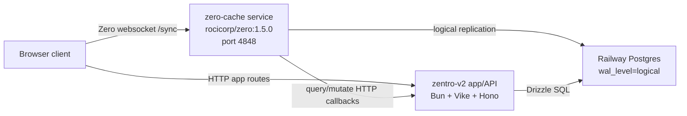

# Railway + Zero Deployment

This document describes the production deployment for Zentro on Railway. It is the source of truth for the current single-node Zero topology, service responsibilities, variables, rollout order, and known operational checks.

## Current Railway Project

- Railway project: `cad7dd28-6e31-499a-a247-6b9293605190`
- Environment: `production`
- App service: `zentro-v2`
- Zero service: `zero-cache`
- Database service: `Postgres`
- App public URL: `https://zentro.relicware.co`
- Zero public URL: `https://zero.relicware.co`

Do not commit Railway secrets, database passwords, or auth secrets. Keep those in Railway variables only.

## Topology

The current deployment uses Zero's minimum viable self-hosted topology:



Services stay in the same Railway project and environment so private service references can be used for database connectivity. Only the app and `zero-cache` need public domains. The database is not public.

## Source And Build

The app service deploys from the Git repository. Railway configuration lives in:

- `railway.json`: Railway build/deploy settings.
- `railpack.json`: Railpack package/build/start hints.
- `package.json`: scripts used by Railway.

Production must run with Bun:

```sh
bun run build
bun run start
```

The app start script is:

```sh
bun ./dist/server/index.mjs
```

`railway.json` also runs migrations before deploy:

```sh
bun run db:migrate
```

## App Service Variables

Set these on the `zentro-v2` service.

| Variable | Value |
| --- | --- |
| `DATABASE_URL` | `${{ Postgres.DATABASE_URL }}` |
| `NODE_ENV` | `production` |
| `BETTER_AUTH_URL` | `https://${{ zentro-v2.RAILWAY_PUBLIC_DOMAIN }}` |
| `BETTER_AUTH_COOKIE_DOMAIN` | `relicware.co` (root domain for sibling subdomains) |
| `BETTER_AUTH_SECRET` | Secret generated value |
| `BETTER_AUTH_TRUSTED_ORIGINS` | `https://${{ zentro-v2.RAILWAY_PUBLIC_DOMAIN }},https://${{ zero-cache.RAILWAY_PUBLIC_DOMAIN }}` |
| `ZERO_CACHE_URL` | `https://${{ zero-cache.RAILWAY_PUBLIC_DOMAIN }}` |
| `VITE_ZERO_CACHE_URL` | `https://${{ zero-cache.RAILWAY_PUBLIC_DOMAIN }}` (compatibility; runtime uses `ZERO_CACHE_URL`) |

`ZERO_CACHE_URL` is intentionally runtime-read by `server/runtime-config.server.ts` and exposed as `/api/runtime-config`. This avoids freezing `http://localhost:4848` into the static Vike HTML or client bundle during Git-based Railway builds.

## Zero-Cache Service

Deploy `zero-cache` as a Docker image service:

```txt
rocicorp/zero:1.5.0
```

Runtime requirements:

- Public routing to port `4848`.
- Persistent volume mounted at `/data`.
- `ZERO_REPLICA_FILE=/data/replica.db`.
- Health check path: `/keepalive`.
- Generous startup and shutdown windows. Ten minutes is a good default for initial syncs and replica restores.

Set these on the `zero-cache` service.

| Variable | Value |
| --- | --- |
| `ZERO_UPSTREAM_DB` | Railway reference to `Postgres.DATABASE_URL`; must be a direct Postgres connection |
| `ZERO_CVR_DB` | Railway reference to `Postgres.DATABASE_URL` for the current MVP |
| `ZERO_CHANGE_DB` | Railway reference to `Postgres.DATABASE_URL` for the current MVP |
| `ZERO_REPLICA_FILE` | `/data/replica.db` |
| `ZERO_ADMIN_PASSWORD` | Secret generated value |
| `ZERO_QUERY_URL` | `https://${{ zentro-v2.RAILWAY_PUBLIC_DOMAIN }}/api/zero/query` |
| `ZERO_MUTATE_URL` | `https://${{ zentro-v2.RAILWAY_PUBLIC_DOMAIN }}/api/zero/mutate` |
| `ZERO_QUERY_FORWARD_COOKIES` | `true` |
| `ZERO_MUTATE_FORWARD_COOKIES` | `true` |
| `ZERO_ENABLE_CRUD_MUTATIONS` | `false` |
| `ZERO_APP_ID` | `zentro` |
| `ZERO_LOG_LEVEL` | `info` |

`ZERO_QUERY_FORWARD_COOKIES` and `ZERO_MUTATE_FORWARD_COOKIES` are required because better-auth derives the Zero context from cookies on the app API endpoints.

## Postgres Logical Replication

Zero requires Postgres logical replication. `wal_level` is not a normal application env var. It is a Postgres server parameter and needs a database restart after changing it.

Run this in the Railway Postgres SQL shell:

```sql
ALTER SYSTEM SET wal_level = 'logical';
```

Then restart the Railway `Postgres` service and verify:

```sql
SHOW wal_level;
```

The expected result is:

```txt
logical
```

Until this is `logical`, `zero-cache` will fail with:

```txt
Postgres must be configured with "wal_level = logical"
```

## Runtime Config Flow

Because this app is configured as full CSR (`ssr: false`), Vike may serve static HTML generated at build time. Production Zero configuration must therefore not depend only on `import.meta.env`.

The runtime flow is:

1. Railway injects `ZERO_CACHE_URL` into the app container.
2. `server/runtime-config.server.ts` reads `ZERO_CACHE_URL` at request time.
3. `server/hono.ts` exposes it at `GET /api/runtime-config`.
4. `pages/+Layout.tsx` fetches that endpoint before mounting `ZeroProvider`.
5. `src/zero/zero-provider.client.tsx` passes the runtime `cacheURL` into `createZeroOptions`.

This prevents production clients from connecting to:

```txt
ws://localhost:4848/sync/v50/connect
```

## Auth And Cookie Domains

Production uses sibling custom domains on a shared root:

```txt
zentro.relicware.co   (app)
zero.relicware.co     (zero-cache)
```

Configure auth with Railway reference variables so domain changes redeploy automatically:

```txt
BETTER_AUTH_URL=https://${{ zentro-v2.RAILWAY_PUBLIC_DOMAIN }}
BETTER_AUTH_COOKIE_DOMAIN=relicware.co
BETTER_AUTH_TRUSTED_ORIGINS=https://${{ zentro-v2.RAILWAY_PUBLIC_DOMAIN }},https://${{ zero-cache.RAILWAY_PUBLIC_DOMAIN }}
ZERO_CACHE_URL=https://${{ zero-cache.RAILWAY_PUBLIC_DOMAIN }}
VITE_ZERO_CACHE_URL=https://${{ zero-cache.RAILWAY_PUBLIC_DOMAIN }}
```

On `zero-cache`:

```txt
ZERO_QUERY_URL=https://${{ zentro-v2.RAILWAY_PUBLIC_DOMAIN }}/api/zero/query
ZERO_MUTATE_URL=https://${{ zentro-v2.RAILWAY_PUBLIC_DOMAIN }}/api/zero/mutate
```

`BETTER_AUTH_COOKIE_DOMAIN` must stay a literal root domain (not a Railway reference). It is the only auth-related variable that cannot be derived from `RAILWAY_PUBLIC_DOMAIN`.

### Railway default domains do not work for Zero cookie auth

Do not use `*.up.railway.app` domains for Zero with cookie auth. `up.railway.app` is on the [Public Suffix List](https://github.com/publicsuffix/list/pull/2552), so browsers will not share session cookies between separate Railway hostnames. Symptom:

```txt
Connection userID does not match validated server userID.
```

Use custom sibling subdomains (as above) or switch Zero to token auth.

Keep `SameSite=None` out of the auth setup unless there is a specific browser flow that requires it.

## Deployment Order

For normal app changes:

1. Push to the Git repository.
2. Railway rebuilds and deploys `zentro-v2`.
3. Pre-deploy migrations run with `bun run db:migrate`.
4. Verify `/`, `/login`, and `/api/runtime-config`.

For Zero or schema changes:

1. Apply additive database migrations first.
2. Regenerate Zero schema if Drizzle schema changed:

   ```sh
   bun run zero:schema:gen
   ```

3. Deploy `zero-cache` if the Zero version or cache config changed.
4. Deploy the app/API service.
5. Deploy clients.
6. After clients have refreshed, run contract migrations that drop or rename obsolete tables or columns.

Avoid bundling Zero version upgrades and destructive schema changes in the same deployment.

## Health Checks

App checks:

```sh
curl -I https://zentro.relicware.co/
curl -I https://zentro.relicware.co/login
curl https://zentro.relicware.co/api/runtime-config
```

Zero checks:

```sh
curl -f https://zero.relicware.co/keepalive
```

Railway CLI checks:

```sh
railway logs --service zentro-v2 --lines 100
railway logs --service zero-cache --lines 100
railway variable list --service zentro-v2 --kv
railway variable list --service zero-cache --kv
```

Do not paste secret-bearing `railway variable list --kv` output into issues, commits, or chat.

## Common Failures

### Client Connects To Localhost

Symptom:

```txt
ws://localhost:4848/sync/v50/connect
```

Checks:

1. `ZERO_CACHE_URL` is set on the app service.
2. `/api/runtime-config` returns the public zero-cache URL.
3. The deployed app includes the latest `pages/+Layout.tsx` runtime-config gate.
4. Browser cache is refreshed after deploy.

### Zero-Cache Fails On WAL Level

Symptom:

```txt
Postgres must be configured with "wal_level = logical"
```

Fix:

1. Run `ALTER SYSTEM SET wal_level = 'logical';` in Postgres.
2. Restart the Postgres service.
3. Verify `SHOW wal_level;`.
4. Restart or redeploy `zero-cache`.

### Auth Or Queries Miss Session Context

Symptom:

```txt
Connection userID does not match validated server userID.
```

Checks:

1. App and zero-cache use sibling custom domains on a shared root (not separate `*.up.railway.app` hostnames).
2. `BETTER_AUTH_COOKIE_DOMAIN` matches the shared root (for example `relicware.co`).
3. `BETTER_AUTH_URL` matches the app origin.
4. `BETTER_AUTH_TRUSTED_ORIGINS` includes both app and zero-cache origins.
5. `ZERO_QUERY_FORWARD_COOKIES=true`.
6. `ZERO_MUTATE_FORWARD_COOKIES=true`.
7. Users re-login after changing cookie domain so cookies are re-issued with the new `Domain`.

## Future Scale-Up

The current topology runs one `zero-cache` service. When hydration or websocket load requires horizontal scaling, split Zero into:

- One replication-manager service on port `4849`, private only.
- One or more view-syncer services on port `4848`, public.
- Sticky sessions for view-syncers.
- S3/Litestream backup on the replication-manager only.

Do not expose the replication-manager to the public internet.
